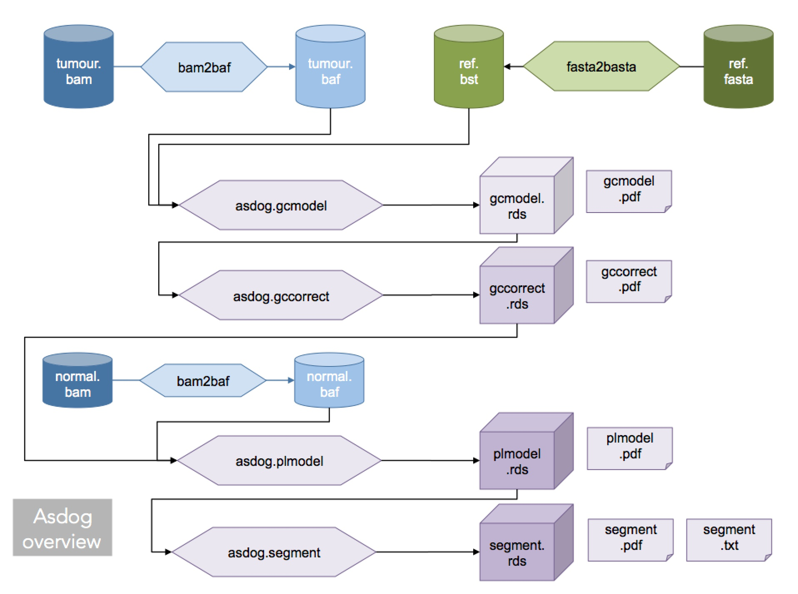

# Asdog usage

## overview



Adog uses its own file format (for quicker indexed access) for:

- reference genome (.bst basta file)
- aligned bam file (.baf baf file)

a **basta** file is merely the same as the fasta file (plus a header allowing
indexed access). It can be (bgzf) compressed. It has about the same size 
as the fasta file (uncompressed) and about 700 Mb in compressed form.

a **baf** file contains the counts for each allele at each position.
It can be (bgzf) compressed.
Its size depends upon the cover but is usually around 3Gb when compressed.

## generation of baf and basta files

### bam to baf 
baf files are produced from **sorted bam** files
by the command ```bam2baf``` (located is in ```ports/<portname>/bin```)
>
> Sept 2018 : version 1.2 indel bug corrected
> added -q and -Q options
> disk write speedup
>
> Jan 2019 : version 1.4 bam2baf will multithread compression
> this is a 30% time gain
>
```
bam2baf Version 1.4
------------------------------------------
synopsis:
  convert bam to baf format
use: bam2baf[options] in.bam out.baf
------------------------------------------
options:

-h : this[H]elp

-p : generate[P]seudo baf (header only)

-q INT : min map[q]uality (dft=0)

-q INT : min base[Q]uality (dft=13)

-v : set[V]erbose mode

-z : compress outfile with bg[Z]f

-@ INT : number of threads for compressing
         0=max available (dft=0)
```
I advise to put the option z which will produce a compressed baf
\<file\>.baf.bgz, it takes a little longer but the size of the file
is really smaller (factor 10 to 100).

### fasta to basta 
In the same way, the basta file of the genome is created from
the fasta file by ```fasta2basta```

```
fasta2basta Version 1.1
------------------------------------------
synopsis:
  convert fasta to basta format
use: fasta2basta[-@ n -v -h -z] in.fst out.bst
------------------------------------------
options:

-h : this[H]elp

-v : set[V]erbose mode

-z : compress outfile with bg[Z]f

-@ INT : number of threads for compressing
         0:max available (dft=0)
```

same remark on the option -z to create a compressed version.

## Asdog scripts

all scripts are now called ```asdog.xxx```

the calling sequence order is:

- asdog.gcmodel.r : builds the GC model
- asdog.gccorrect.r : calculates the GC correction from the previous model
- asdog.plmodel.r : builds the ploidy model
- asdog.segment.segment.r : calculates the segmentation

the usage of scripts is given by running the script without arguments
(short version) or with the ```--help``` argument
(version with the list of all available options)

the scripts will produce:
- .rds files (to be further reloaded in R)
- (optionally) pdf and txt files

### additional helper script (not in all distributions):

- asdog.report.r : forces the reporting of the results of one of the previous scripts
- asdog.matchpair.r : checks for tumor/normal matching
- asdog.popmap.r : calculates the most likely hapmap population

### asdog.gcmodel.r
```
use: asdog.gcmodel.r --base=<base> --ref=<ref>[--outdir=<dir>][--<option>=<value>]
       <base> := path to baf file (without extension)
       <ref> : = path to ref genome basta file (without extension)
       <dir> := output directory (dft='.'')
use --help to get a list of available options
```

### asdog.gccorrect.r
```
use: asdog.gccorrect.r --gcmodel=<gcmodel>[--outdir=<dir>][--<option>=<value>]
       <gcmodel> := path to GC model (.rds) file
       <dir> := output directory (dft=.)
use --help to get a list of available options
```

### asdog.plmodel.r
```
use: asdog.plmodel.r --normal=<normal> --gccorrect=<gccorrect>[--outdir=<dir>][--<option>=<value>]
 or asdog.plmodel.r --plmodel=<plmodel>[--outdir=<dir>][--<option>=<value>]
       <normal> := path to normal baf file (without extension)
       <gccorrect> := path to gccorrect (.rds) file
       <plmodel> := path to previous plmodel (.rds) file
       <dir> := output directory (dft='.'')
use --help to get a list of available options
```

***Notice*** Because of a bug in the `bcp` library (underflow), the default
pre-segmentation mode for ploidy model is `--plmodel.preseg.mode=shmm`. If you are
on a MacOSX box, you may switch back to `--plmodel.preseg.mode=bcp` (which is more
robust), on linux please keep the default value until I find the bug. 


### asdog.segment.r 
```
use: asdog.segment.r --gccorrect=<gccorrect>[-- --plmodel=<plmodel>][--outdir=<dir>][--<option>=<value>]
       <gccorrect> := path to gccorrect (.rds) file
       <plmodel> := path to ploidy model (.rds) file
       <dir> := output directory (dft=.)
use --help to get a list of available options
```

## output files

TBD


